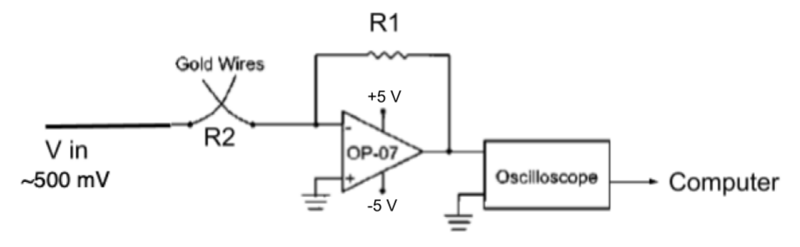

**Experimental Goal:**

&nbsp;&nbsp;&nbsp;&nbsp;&nbsp;The goal of this experiment is to investigate the quantum nature of electrical conductance in a gold break junction.

**Procedure Description and Brief Background:**

&nbsp;&nbsp;&nbsp;&nbsp;&nbsp;Two gold wires are brought into contact and then slowly separated while a voltage is applied across the junction.
As the contact narrows 
&nbsp;&nbsp;&nbsp;&nbsp;&nbsp;to atomic dimensions, electrons can only travel through a discrete number of quantum transport channels. 
Instead of changing 
&nbsp;&nbsp;&nbsp;&nbsp;&nbsp;continuously, the conductance changes in quantized steps corresponding to integer multiples of a 
fundamental unit of conductance.

**Key Findings:**

&nbsp;&nbsp;&nbsp;&nbsp;&nbsp;I was able to successfully isolate and identify distinct peaks in the conductance of the wires based on an analysis of 
the voltage data. I &nbsp;&nbsp;&nbsp;&nbsp;&nbsp;experimentally confirmed the quantized nature of the atomic-scale gold contact, only differing from the
theoretical value of conductance &nbsp;&nbsp;&nbsp;&nbsp;&nbsp;by roughly 3.5%. 

**Experimental Setup Diagram**

